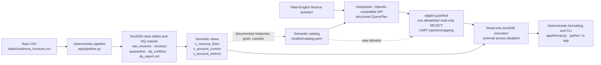

# CloudNova Architecture

> **The model interprets the question; deterministic code owns the financial
> rules.**

## Build path

`python -m app build` reads every source field as a string, adds audit
metadata, applies configured normalization, validates required values, and
performs deduplication in three fixed stages. It writes raw and canonical
tables, quarantine and conflict audit tables, the semantic views, and the data
quality report.

Financial behavior is deterministic:

- USD conversion follows the locked division rule.
- Invoice reconciliation and MRR come from configured prices and subscription
  terms.
- Recognized revenue, refunds, and exposure are encoded in
  `v_revenue_lines`.
- Current account state and account metrics are encoded in
  `v_account_current` and `v_account_metrics`.

## Query path

`python -m app ask "QUESTION"` builds first only when the configured database
is absent. The query path then:

1. Sends the question, catalog, and query rules to the configured
   OpenAI-compatible provider.
2. Validates the JSON response as a Pydantic `QueryPlan`.
3. Parses proposed SQL using the DuckDB dialect in sqlglot.
4. Requires exactly one read-only `SELECT` or `WITH ... SELECT`.
5. Rejects raw/non-catalog tables, mutation SQL, qualified-source bypasses, and
   external table functions.
6. Injects or caps the configured row limit.
7. Executes against DuckDB in read-only mode with external access disabled.
8. Formats database values and prints the answer, result table, generated SQL,
   assumptions, views, and catalog caveats without a second model call.

## Why this is not RAG

The stakeholder questions require exact sums, rates, rankings, and account
grain. Semantic retrieval can locate relevant documents, but it cannot enforce
accounting definitions or guarantee arithmetic. The catalog helps the model
select trusted semantic columns; DuckDB performs the calculation.

## Evaluation boundary

`evals/reference.sql` independently queries only semantic views. The eval
runner executes those references separately from agent-generated SQL and
compares returned values with a $0.01 tolerance. Unsupported behavior and the
documented provenance limitation are evaluated separately.

The SQL guardrail is defense in depth, not a complete security boundary.
Provider output remains variable, and the current application is a
single-process prototype.
